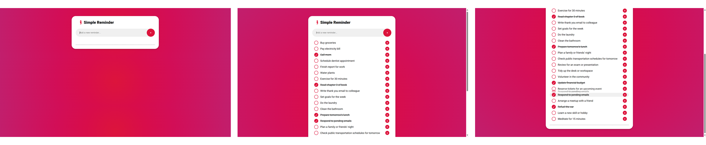

# Web - Simple Reminder

This project is a small web application for task management. The goal was to make it as simple and efficient as possible. Users can add tasks, check them off, change their order, and delete them. The application saves data in the local storage to prevent any loss of information.
<br><br>
As with many of my projects, the aim was to work from scratch without using any frameworks. Here, the focus was primarily on honing my JavaScript skills. Despite the final output being very minimalist, it aligns with my initial idea.
<br><br>
If this project piques your interest, feel free to use it at your discretion. Despite its simplicity, the code is designed to be clear and modifiable, offering the possibility of adding new features in the future while preserving its ease of use.

## 🔖 Table of contents

<details>
        <summary>
		CLICK TO ENLARGE 😇
        </summary>
	    📝 <a href="#description">Description</a>
        <br>
        🔨 <a href="#tech-stack">Tech stack</a>
        <br>
        📂 <a href="#files-description">Files description</a>
        <br>
        💻 <a href="#installation">Installation</a>
        <br>
        🔧 <a href="#whats-next">What's next ?</a>
        <br>
        ♥️ <a href="#thanks">Thanks</a>
        <br>
        👷 <a href="#authors">Authors</a>
</details>

## 📝 <span id="description">Description</span>


## 🔨 <span id="tech-stack">Tech stack</span>

<p align="left">
    
    
    
<p>

## 📂 <span id="files-description">Files description</span>

| FILE               | DESCRIPTION                                                  |
| :----------------: | ------------------------------------------------------------ |
| `resources`        | Contains the fonts and images required for the landing page. |
| `README.md`        | The readme file you are currently reading ;).                |
| `behavior.js`      | JavaScript code for dynamic page interactions.               |
| `index.html`       | Main HTML file for the Simple Reminder page.                 |
| `style.css`        | CSS stylesheet for the Simple Reminder layout.               |

## 💻 <span id="installation">Installation</span>

1. Clone this repository:
    - Open your preferred Terminal.
    - Navigate to the directory where you want to clone the repository.
    - Run the following command:
```
git clone https://github.com/fchavonet/web-simple_reminder.git
```

2. Open the folder in your favorite IDE.

To test this little web application, visit <a href="https://fchavonet.github.io/web-simple_reminder/">the Simple Reminder online</a>.

<p align="center">

</p>

## 🔧 <span id="whats-next">What's next ?</span>

- Adding a function to automatically move a checked reminder to the bottom of the list.
- Added a function to indicate the priority of a reminder.
- Clean and optimize the Javascript code.

## ♥️ <span id="thanks">Thanks</span>

A big thank you to my friends Pierre and Yoann for taking time out of their busy schedule to test this little web application.

## 👷 <span id="authors">Authors</span>

**Fabien CHAVONET**
- Github: [@fchavonet](https://github.com/fchavonet)
