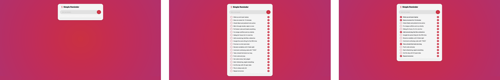

# Simple Reminder

## 🔖 Table of contents

<details>
    <summary>
        CLICK TO ENLARGE 😇
    </summary>
    📄 <a href="#description">Description</a>
    <br>
    🎓 <a href="#objectives">Objectives</a>
    <br>
    🔨 <a href="#tech-stack">Tech stack</a>
    <br>
    📂 <a href="#files-description">Files description</a>
    <br>
    💻 <a href="#installation_and_how_to_use">Installation and how to use</a>
    <br>
    🔧 <a href="#whats-next">What's next?</a>
    <br>
    ♥️ <a href="#thanks">Thanks</a>
    <br>
    👷 <a href="#authors">Authors</a>
</details>

## 📄 <span id="description">Description</span>

This project is a small web application for task management. The goal was to make it as simple and efficient as possible. Users can add tasks, check them off, change their order, and delete them. The application uses local storage to preserve your tasks, even after closing the browser.

## 🎓 <span id="objectives">Objectives</span>

- The project was built from scratch, intentionally avoiding the use of any frameworks.
- The main objective was to improve my JavaScript skills.
- The final result is minimalist, in line with my original concept.

## 🔨 <span id="tech-stack">Tech stack</span>

<p align="left">
    
    
    
    
    
    
    
</p>

## 📂 <span id="files-description">File description</span>

| **FILE**     | **DESCRIPTION**                                     |
| :----------: | --------------------------------------------------- |
| `assets`     | Contains the resources required for the repository. |
| `index.html` | Main HTML structure for the project.                |
| `style.css`  | Styles and animations for the project.              |
| `script.js`  | Behavior script for interactivity.                  |
| `README.md`  | The README file you are currently reading 😉.       |

## 💻 <span id="installation_and_how_to_use">Installation and how to use</span>

**Installation:**

1. Clone this repository:
    - Open your preferred Terminal.
    - Navigate to the directory where you want to clone the repository.
    - Run the following command:

```
git clone https://github.com/fchavonet/web-simple_reminder.git
```

2. Open the repository you've just cloned.

**How to use:**

1. Open the `index.html` file in your web browser.

2. Type a reminder into the input field.

3. Press `Enter` or click the "+" button to add it.

4. Click on a reminder to mark it as done (it will be crossed out).

5. Drag and drop reminders to reorder them.

6. Click the "X" button to delete a reminder.

You can also test the web application online by clicking [here](https://fchavonet.github.io/web-simple_reminder/).

<p align="center">
    
</p>

## 🔧 <span id="whats-next">What's next?</span>

- Adding a function to automatically move a checked reminder to the bottom of the list.
- Add a function to indicate the priority of a reminder.
- Clean and optimize the Javascript code.

## ♥️ <span id="thanks">Thanks</span>

- A big thank you to my friends Pierre and Yoann, always available to test and provide feedback on my projects.

## 👷 <span id="authors">Authors</span>

**Fabien CHAVONET**
- Github: [@fchavonet](https://github.com/fchavonet)
