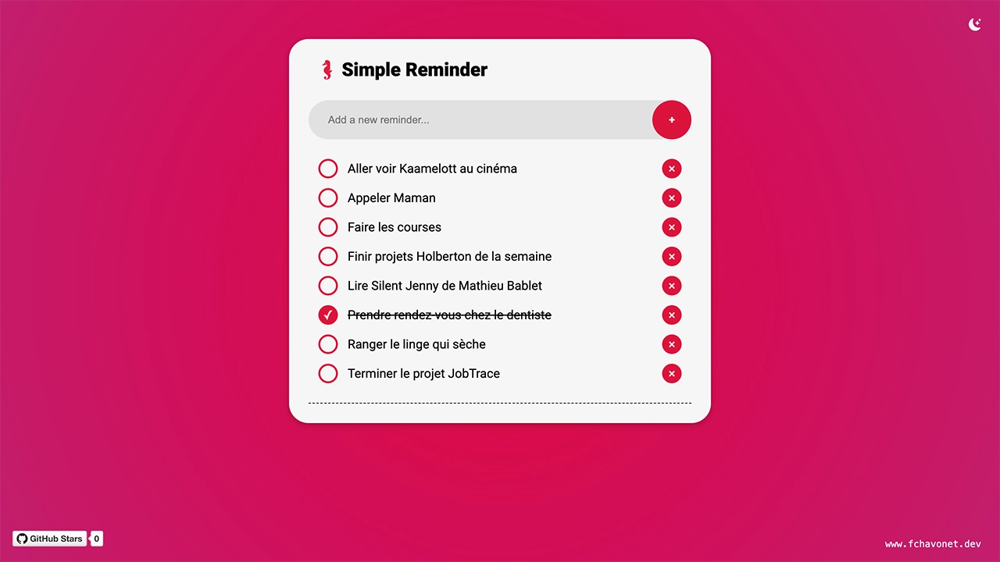

# Simple Reminder

## Description

This project is a lightweight web application for simple task management.

The goal was to make it as simple, intuitive, and efficient as possible. Users can add tasks, check them off, change their order, and delete them. The application uses local storage to preserve your tasks, even after closing the browser.

## Objectives

- Build the project entirely from scratch, intentionally avoiding any frameworks.
- Improve my JavaScript skills through hands-on development.
- Deliver a minimalist result aligned with the original concept.

## Tech Stack


## File Description

| **FILE**     | **DESCRIPTION**                                     |
| :----------: | --------------------------------------------------- |
| `assets`     | Contains the resources required for the repository. |
| `index.html` | Main HTML structure for the project.                |
| `style.css`  | Styles and animations for the project.              |
| `script.js`  | Behavior script for interactivity.                  |
| `README.md`  | The README file you are currently reading 😉.       |

## Installation & Usage

### Installation

1. Clone this repository:
    - Open your preferred Terminal.
    - Navigate to the directory where you want to clone the repository.
    - Run the following command:

```
git clone https://github.com/fchavonet/creative_coding-simple_reminder.git
```

2. Open the cloned repository.

### Usage

1. Open the `index.html` file in your web browser.

2. Type a reminder into the input field.

3. Press `Enter` or click the `+` button to add it.

4. Click on a reminder to mark it as done (it will be crossed out).

5. Drag and drop reminders to reorder them.

6. Click the `X` button to delete a reminder.

You can also test the project online by clicking [here](https://fchavonet.github.io/creative_coding-simple_reminder/).

<p align="center">
    <picture>
        <source media="(prefers-color-scheme: dark)" srcset="./assets/images/screenshots/desktop_page_screenshot-dark.webp">
        <source media="(prefers-color-scheme: light)" srcset="./assets/images/screenshots/desktop_page_screenshot-light.webp">
        
    </picture>
</p>

## What's Next?

- Add a function to automatically move checked reminders to the bottom of the list.
- Add a priority indicator for reminders.
- Clean and optimize the JavaScript code.

## Thanks

- A big thank you to my friends Pierre and Yoann, always available to test and provide feedback on my projects.

## Author(s)

**Fabien CHAVONET**
- GitHub: [@fchavonet](https://github.com/fchavonet)
